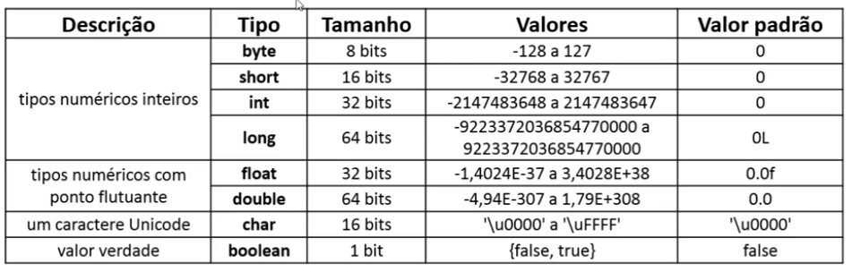

# O que são variáveis?

São espaços de armazenamento na memória do computador que contêm valores.

Podem ser utilizadas para armazenar diferentes tipos de dados, como números, texto, caracteres, entre outros.

## Para que servem as variáveis?

As variáveis são úteis para armazenar informações temporárias ou permanentes durante a execução de um programa.
Permitem manipular e processar dados de forma dinâmica.

## Resumindo:
Um programa de computador em execução lida com dados.

E como esses dados são armazenados? Em variáveis.

### Tipos de variáveis:

- **int (número inteiro):** Utilizado para armazenar números inteiros.
- **double (número decimal):** Usado para armazenar números decimais.
- **String (texto):** Serve para armazenar sequências de caracteres, como palavras ou frase.
- **char (caractere):** Representa um único caractere, como uma letra ou símbolo.
- **boolean (booleano):** Armazena valores lógicos verdadeiro ou falso.

### Sintaxe:
tipo nome = valor inicial; -> opcional.

### Nomes de variáveis:

**Não pode começar com dígito:** use uma letra ou _

**Não pode ter espaço em branco**

**Não pode usar acentos ou til**

**Sugestão:** use o padrão “**camel case**”

---

**Errado:**

int 5minutos;

int salário;

int salário do funcionário;

---

**Correto:**

int _5minutos;

int salario;

int salarioDoFuncionario;

---

## Tipos primitivos em Java:

